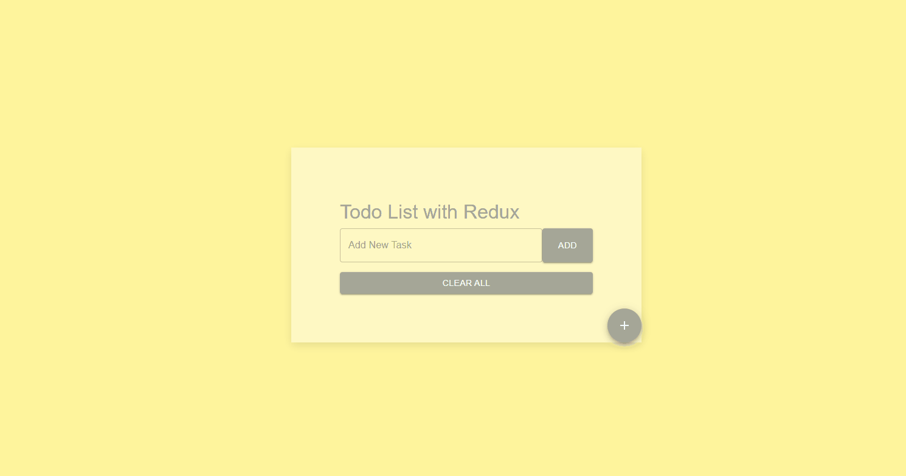

# Todo List with Redux
This project is a website created using React, Redux, and Material-UI. It includes a simple "Todo List" application where users can add, edit, mark tasks as completed, and delete them.
## Screenshots
 

[Todo List with Redux Live Page](https://todo-redux-esma.netlify.app/)

## Tech/framework used
<b>Built with</b>  
 
 
 

## How to use?
To add a new task, enter text in the "Add New Task" box and click the "Add" button. 
To edit an existing task, click the "Edit" icon, enter the new text, and click the "Edit" button. 
To mark a task as completed or incomplete, click the "Check" icon. 
To delete a task, click the "Delete" icon. 
To clear all tasks, click the "Clear All" button. 

## Description
In the project directory, you can run:
### `npm start`
Runs the app in the development mode.\
Open [http://localhost:3000](http://localhost:3000) to view it in your browser.

 
